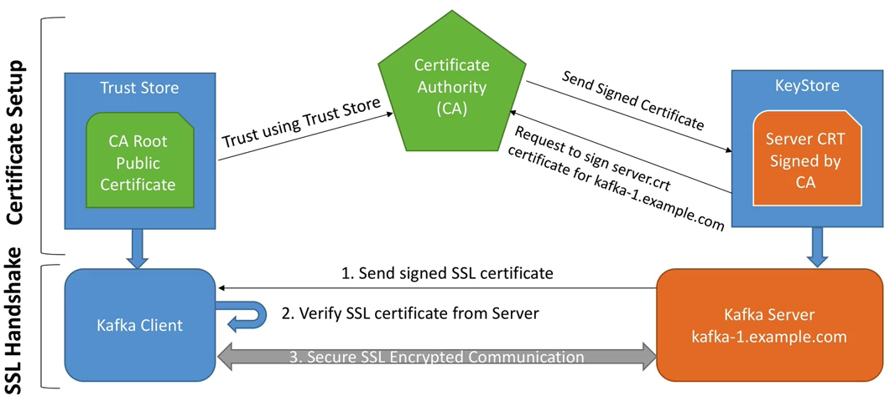

# A kafka use case


## Planejamento

### Stories
- Classifiquei os itens do case como stories, os priorizei de acordo com suas dependências e estimei esforço com planning poker usando fibonacci:


- (*) são stories desejadas/diferenciais.
- O esforço foi estimado apenas para as stories principais do sprint, caso sobre tempo puxarei outras stories (*) para não comprometer a entrega.

### Stories tasks


## Acompanhamento

- Capacity: 40 pontos para sprint de 1 semana.
- Burndown planejado:


Link para acompanhar em tempo real:

> [Burndown](https://docs.google.com/spreadsheets/d/1on_Sd3mgyJTbZywISEAddIVEQWIgD7vHJqxPstqXXao/edit?usp=sharing)


## Arquitetura proposta

### Diagrama de arquitetura


- Cluster com 3 replicas de um container zookeeper;
- Cluster com 3 replicas de um container kafka;
- Armazenamento persistente de dados, configurações e logs fora dos containers de zookeeper e kafka;
- Um container com uma imagem de kafka como client e ferramentas necessárias para desenvolvimento do producer e consumer;
- Um container com prometheus para coletar as métricas e grafana para monitoração;
- Tudo orquestrado por um docker-compose que iniciará os serviços;
- Rodando em notebook pessoal com Linux Mint 64bits.

### Diagrama de implementação


- Itens em azul são containers

## Tecnologias

- Python 3.6.7
- Go 1.12.5
- Docker 18.09.2
- Docker-compose 1.17.1
- Apache Kafka 2.2.0
- Apache Zookeeper 3.5.5
- Prometheus JMX Expoeter Agent 0.11.0
- Prometheus 2.9.2
- Grafana 6.1.6
- Visual Studio Code
- Linux Mint 64bits


# Como rodar o ambiente

>## Pré-requisitos
- [Docker 18.09.5](https://docs.docker.com/v17.12/install)
- [Docker-Compose 1.17.1](https://docs.docker.com/compose/install)

>## Iniciar o cluster

```
./start_cluster.sh
```
- Irá realizar o build das imagens usadas no cluster;
- Realizar a criação inicial dos diretorios de armazenamento persistente;
- Iniciar toda a orquestração para subir o ambiente


Todos os dados, logs e configurações estão persistentes e fora dos containers, assim se você parar um container do cluster ou o cluster todo e subir novamente todo o histórico será mantido.

### Locais do armazenamento persistente


### Kafka

- Config

    ```./kafka/config/kafka<node_id>/```

- Dados
  
    ```./kafka/log/kafka<node_id>/log/```

- Log
  
    ```./kafka/log/kafka<node_id>/```


### Zookeeper

- Config

    ```./zookeeper/conf/zookeeper<node_id>/```

- Dados

    ```./zookeeper/data/zookeeper<node_id>/```

- Log

    ```./zookeeper/log/zookeeper<node_id>/```


### Prometheus

- Config

    ```./kafka_monitoring/prometheus/config/```

- Dados

    ```./kafka_monitoring/prometheus/data/```


### Grafana

- Config

    ```./kafka_monitoring/grafana/conf/```

- Dados

    ```./kafka_monitoring/grafana/data/```

  
>## Monitoração

Acompanhar logs do cluster, rode:

```
docker-compose logs -f
```

Para acompanhar log de um nó específico, rode:

```
docker-compose logs <nome_servico> -f
```

## Grafana

No Grafana você consegue monitorar os principais indicadores que julga importante para acompanhar a "saúde" do kafka.
Para acessar o grafana:
[http://localhost:3000](http://localhost:3000)


## Prometheus
É onde são armazenadas as métricas que são coletadas dos brokers, estes dados servem de base para o grafana, Acesse o prometheus através do endereço:
[http://localhost:9090](http://localhost:9090)


>## Aplicações de exemplo

### Producer
```
docker exec -it kafka_client go run ./src/app_producer/producer.go
```
Se não informar nada, pegará os valores default definidos nas variaveis de ambiente do container, ou você pode fazer um override usando um dos parametros abaixo.

Parametros

- kafka (string) - Lista de kafka brokers (default "kafka1:9092,kafka2:9093,kafka3:9094")
- loop (bool) - Produzir mensagens de teste infinitamente
- topic (string) - Tópico que deseja produzir as mensagens (default "test-topic")
- verbose (bool) - Informe se quer log mais verboso

### Consumer
```
docker exec -it kafka_client go run ./src/app_consumer/consumer.go
```
Se não informar nada, pegará os valores default definidos nas variaveis de ambiente do container, ou você pode fazer um override usando um dos parametros abaixo.

Parametros

- consumer (string) - Consumer group das mensagens (default "flinox")
- latest (book) - Informe false para buscar as mensagens mais antigas (default true)
- topic (string) - Tópico que deseja consumir as mensagens (default "test-topic")
- verbose (bool) - Informe se quer log mais verboso
- zookeeper (string) - Lista dos zookeepers (default "zookeeper1:2181,zookeeper2:2181,zookeeper3:2181")


>## Segurança

## Encryption

Como a SSL encryption funciona:


- Vamos simular um CA privado no kafka_monitoring para fazer a SSL encryption.


Sobre os dados trafegando na rede entre clients e brokers
Encrypt Data ( SSL old version ) TLS ( Transport Layer Security ) new version
SSL Protocol ( HTTPS )

I-way verification ( Exemplo: browser > website ) ( Encryption )
2-way verification, SSL authentication ( Authentication )

CA ( Certificate Authority ) usamos nossa própria, private

Kafka Server, keystore ( to CA )

SSL Handshake

## Criando o CA
> kafka_monitoring
mkdir /opt/ssl
cd /opt/ssl
openssl req -new -newkey rsa:4096 -days 365 -x509 -subj "/CN=kafka-security-CA" -keyout ca-key -out ca-cert -nodes

-- Private key
ca-key

-- Certificate key (public)
ca-cert

## Criando a keystore for kafka1
> kafka_monitoring
export SERVERPASSWORD=password
cd /opt/ssl
keytool -genkey -keystore kafka1.keystore.jks -validity 365 -storepass $SERVERPASSWORD -keypass $SERVERPASSWORD -dname "CN=kafka1" -storetype pkcs12

-- olhar o conteudo
keytool -list -v -keystore kafka1.keystore.jks

-- generate the sign request ( Enviaria o cert-file para o CA e receberia sign version do seu certificado )
keytool -keystore kafka1.keystore.jks -certreq -file cert-file -storepass $SERVERPASSWORD -keypass $SERVERPASSWORD

-- assinando o cert-file nos mesmos pelo nosso CA privado, resultado teremos o cert-signed para o kafka1
openssl x509 -req -CA ca-cert -CAkey ca-key -in cert-file -out cert-signed -days 365 -CAcreateserial -passin pass:$SERVERPASSWORD

-- olhar o conteudo
keytool -printcert -v -file cert-signed


## Criando a truststore for kafka1
> kafka_monitoring
export SERVERPASSWORD=password
keytool -keystore kafka1.truststore.jks -alias CARoot -import -file ca-cert -storepass $SERVERPASSWORD -keypass $SERVERPASSWORD -noprompt

-- import ca-cert to the keystore
keytool -keystore kafka1.keystore.jks -alias CARoot -import -file ca-cert -storepass $SERVERPASSWORD -keypass $SERVERPASSWORD -noprompt

-- import cert-signed to thekeystore
keytool -keystore kafka1.keystore.jks -import -file cert-signed -storepass $SERVERPASSWORD -keypass $SERVERPASSWORD -noprompt


## Configurando o broker kafka para SSL 
copiar os arquivos kafka1*.* para o kafka1 broker pasta /opt/ssl

Alterar o arquivo server.properties conforme exemplo:

```
listeners=PLAINTEXT://0.0.0.0:9092,SSL://0.0.0.0:9093

# Hostname and port the broker will advertise to producers and consumers. If not set, 
# it uses the value for "listeners" if configured.  Otherwise, it will use the value
# returned from java.net.InetAddress.getCanonicalHostName().
advertised.listeners=PLAINTEXT://kafka1:9092,SSL://kafka1:9093

ssl.keystore.location=/opt/ssl/kafka1.keystore.jks
ssl.keystore.password=password
ssl.key.password=password
ssl.truststore.location=/opt/ssl/kafka1.truststore.jks
ssl.truststore.password=password
```


## Clients
copiar ca-cert e cert-signed voce pode distribuir publicamente para os clients


### Script para gerar keystore e truststore para os outros brokers

```

## Criando a keystore for $BROKERNAME
export SERVERPASSWORD=password
export BROKERNAME=kafka2

cd /opt/ssl

## Deletando arquivos antigos
rm cert-file
rm cert-signed
rm ca-cert.srl


keytool -genkey -keystore $BROKERNAME.keystore.jks -validity 365 -storepass $SERVERPASSWORD -keypass $SERVERPASSWORD -dname "CN=${BROKERNAME}" -storetype pkcs12

## olhar o conteudo
# keytool -list -v -keystore $BROKERNAME.keystore.jks

## generate the sign request ( Enviaria o cert-file para o CA e receberia sign version do seu certificado )
keytool -keystore $BROKERNAME.keystore.jks -certreq -file cert-file -storepass $SERVERPASSWORD -keypass $SERVERPASSWORD

## assinando o cert-file nos mesmos pelo nosso CA privado, resultado teremos o cert-signed para o kafkaX
openssl x509 -req -CA ca-cert -CAkey ca-key -in cert-file -out cert-signed -days 365 -CAcreateserial -passin pass:$SERVERPASSWORD

## olhar o conteudo
# keytool -printcert -v -file cert-signed

## Criando a truststore for $BROKERNAME

keytool -keystore $BROKERNAME.truststore.jks -alias CARoot -import -file ca-cert -storepass $SERVERPASSWORD -keypass $SERVERPASSWORD -noprompt

-- import ca-cert to the keystore
keytool -keystore $BROKERNAME.keystore.jks -alias CARoot -import -file ca-cert -storepass $SERVERPASSWORD -keypass $SERVERPASSWORD -noprompt

-- import cert-signed to thekeystore
keytool -keystore $BROKERNAME.keystore.jks -import -file cert-signed -storepass $SERVERPASSWORD -keypass $SERVERPASSWORD -noprompt

```


## Para saber se carregou corretamente o nosso kafka1 com as alteracoes no server.properties, consulte no server.log do broker

```
docker-compose logs kafka1 | grep "EndPoint"
#ou
#grep "EndPoint" /logs/server.log
```

## Para saber se a porta SSL 9093 está acessível, rode:

```
openssl s_client -connect kafka1:9093
```


## Authentication
Clients connect on Kafka Cluster
Client prove their identity to connect on Cluster
SASL ( Kerberos ) Auth

## Authorisation
Publicar e consumir de um topico
ACL ( Access Control List )


## SSH
ssh -i keypair.pem usuario@hostname.com

## Apoio técnico

### Caso queira realizar o build manual das imagens
```
docker build -t flinox/zookeeper ./zookeeper/.
docker build -t flinox/kafka ./kafka/.
docker build -t flinox/kafka_client ./kafka_client/.
docker build -t flinox/kafka_monitoring ./kafka_monitoring/.
```

### Acessar kafka_client
```
docker exec -it kafka_client bash
```

### Listar topicos
```
kafka-topics --zookeeper zookeeper1:2181 --list
```

### Criar topico
```
kafka-topics --zookeeper zookeeper1:2181,zookeeper2:2181,zookeeper3:2181 --create --topic test-topic --partitions 3 --replication-factor 3
```

### Alterar configurações do topico
```
kafka-configs --zookeeper zookeeper1:2181,zookeeper2:2181,zookeeper3:2181 --entity-type topics --entity-name test-topic --alter --add-config 'cleanup.policy=compact'
```
- [Lista completa de configuracoes de tópicos](https://kafka.apache.org/documentation/#topicconfigs)


### Consumir mensagens de um tópico
```
kafka-console-consumer --bootstrap-server kafka1:9092,kafka2:9093,kafka3:9094 \
--topic test-topic \
--timeout-ms 30000 \
--property group.id=flinox \
--from-beginning
```
- Para consumir as mensagens mais recentes apenas remover --from-beginning

### Produzir mensagens em um tópico
```
kafka-console-producer --broker-list kafka1:9092,kafka2:9093,kafka3:9094 --topic test-topic --timeout 30000 --property "client.id=flinox"
```

### Produzir mensagens com chave em um tópico
```
kafka-console-producer --broker-list kafka1:9092,kafka2:9093,kafka3:9094 --topic test-topic --timeout 30000 --property "client.id=flinox" --property "parse.key=true" --property "key.separator=:"
```

### Deletar topico
```
kafka-topics --zookeeper zookeeper1:2181,zookeeper2:2181,zookeeper3:2181 --delete --topic test-topic
```


## Referências

- https://github.com/flinox/kafka_cluster
- https://github.com/flinox/kafka_utils
- https://www.confluent.io/
- https://kafka.apache.org/documentation/
- https://docs.confluent.io/current/kafka/monitoring.html
- https://zookeeper.apache.org/
- https://www.rbco.com.br/graficos-e-indicadores/grafico-burn-down-e-burn-up
- https://courses.datacumulus.com/kafka-monitoring-b88
- https://github.com/prometheus/jmx_exporter
- https://github.com/prometheus/prometheus
- https://grafana.com/
- https://www.udemy.com/user/stephane-maarek/


- https://medium.com/rahasak/kafka-producer-with-golang-fab7348a5f9a
- https://medium.com/rahasak/kafka-consumer-with-golang-a93db6131ac2
- https://courses.datacumulus.com/kafka-security-a42