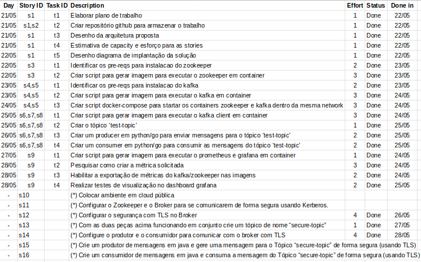

# A kafka use case
Por [Fernando Lino](https://www.linkedin.com/in/flinox/)

## Planejamento

### Stories
- Classifiquei os itens do case como stories, os priorizei de acordo com suas dependências e estimei esforço com planning poker usando fibonacci:


- (*) são stories desejadas/diferenciais.
- O esforço foi estimado apenas para as stories principais do sprint, caso sobre tempo puxarei outras stories (*) para não comprometer a entrega.

- Capacity: 40 pontos para sprint de 1 semana.

### Planejado

>21/05
>>
>>


### Realizado

>28/05
>>
>>

Link para o burndown:

> [Burndown](https://docs.google.com/spreadsheets/d/1on_Sd3mgyJTbZywISEAddIVEQWIgD7vHJqxPstqXXao/edit?usp=sharing)


## Arquitetura proposta

### Diagrama de arquitetura


- Cluster com 3 replicas de um container zookeeper;
- Cluster com 3 replicas de um container kafka;
- Armazenamento persistente de dados, configurações e logs fora dos containers de zookeeper e kafka;
- Um container com uma imagem de kafka como client e ferramentas necessárias para desenvolvimento do producer e consumer;
- Um container com prometheus para coletar as métricas e grafana para monitoração;
- Tudo orquestrado por um docker-compose que iniciará os serviços;
- Rodando em notebook pessoal com Linux Mint 64bits.

### Diagrama de implementação


- Itens em azul são containers


># Como rodar o ambiente

>## Pré-requisitos
- [Docker 18.09.5](https://docs.docker.com/v17.12/install)
- [Docker-Compose 1.17.1](https://docs.docker.com/compose/install)

>## Iniciar o cluster

```
./start_cluster.sh
```
- Irá realizar o build das imagens usadas no cluster;
- Realizar a criação inicial dos diretorios de armazenamento persistente;
- Iniciar toda a orquestração para subir o ambiente

Todos os dados, logs e configurações estão persistentes e fora dos containers, assim se você parar um container do cluster ou o cluster todo e subir novamente todo o histórico será mantido.

### Locais do armazenamento persistente


### Kafka

- Config

    ```./kafka/config/kafka<node_id>/```

- Dados
  
    ```./kafka/log/kafka<node_id>/log/```

- Log
  
    ```./kafka/log/kafka<node_id>/```


### Zookeeper

- Config

    ```./zookeeper/conf/zookeeper<node_id>/```

- Dados

    ```./zookeeper/data/zookeeper<node_id>/```

- Log

    ```./zookeeper/log/zookeeper<node_id>/```


### Prometheus

- Config

    ```./kafka_monitoring/prometheus/config/```

- Dados

    ```./kafka_monitoring/prometheus/data/```


### Grafana

- Config

    ```./kafka_monitoring/grafana/conf/```

- Dados

    ```./kafka_monitoring/grafana/data/```

  


>## Utilizando o cluster

### Criando um tópico 
```
docker exec -it kafka_client bash -c "kafka-topics --zookeeper zookeeper1:2181,zookeeper2:2181,zookeeper3:2181 --create --topic test-topic --partitions 3 --replication-factor 3"
```

### Produzindo mensagens no tópico

```
docker exec -it kafka_client bash -c "kafka-console-producer --broker-list kafka1:9092,kafka2:9092,kafka3:9092 --topic test-topic --timeout 30000"
```

### Consumindo mensagens do tópico

```
docker exec -it kafka_client bash -c "kafka-console-consumer --bootstrap-server kafka1:9092,kafka2:9092,kafka3:9092 --topic test-topic --timeout-ms 30000 --property group.id=flinox --from-beginning"
```


>## Aplicações de exemplo

### Producer Application in Go
```
docker exec -it kafka_client go run ./src/app_producer/producer.go
```
Se não informar nada, pegará os valores default definidos nas variaveis de ambiente do container, ou você pode fazer um override usando um dos parametros abaixo.

Parametros

- kafka (string) - Lista de kafka brokers (default "kafka1:9092,kafka2:9093,kafka3:9094")
- loop (bool) - Produzir mensagens de teste infinitamente
- topic (string) - Tópico que deseja produzir as mensagens (default "test-topic")
- verbose (bool) - Informe se quer log mais verboso

### Consumer Application in Go
```
docker exec -it kafka_client go run ./src/app_consumer/consumer.go
```
Se não informar nada, pegará os valores default definidos nas variaveis de ambiente do container, ou você pode fazer um override usando um dos parametros abaixo.

Parametros

- consumer (string) - Consumer group das mensagens (default "flinox")
- latest (book) - Informe false para buscar as mensagens mais antigas (default true)
- topic (string) - Tópico que deseja consumir as mensagens (default "test-topic")
- verbose (bool) - Informe se quer log mais verboso
- zookeeper (string) - Lista dos zookeepers (default "zookeeper1:2181,zookeeper2:2181,zookeeper3:2181")


>## Monitoração

Acompanhar logs do cluster, rode:

```
docker-compose logs -f
```

Para acompanhar log de um nó específico, rode:

```
docker-compose logs <nome_servico> -f
```

## Grafana

No Grafana você consegue monitorar os principais indicadores que julga importante para acompanhar a "saúde" do kafka.
Para acessar o grafana:
[http://localhost:3000](http://localhost:3000)


## Prometheus
Onde são armazenadas as métricas que são coletadas dos brokers, estes dados servem de base para o grafana, Acesse o prometheus através do endereço:
[http://localhost:9090](http://localhost:9090)


># Segurança

## SSL Encryption

Foi habilitado SSL Encryption para produzir e consumir mensagens do kafka (1-way):

Fonte: https://courses.datacumulus.com/kafka-security-a42

- Foi simulado um CA privado no kafka_monitoring para assinar os certificados gerados.
- Gerando um par de chaves, uma chave publica e uma privada, localizada em:

```
/kafka_monitoring/ssl/ca-cert
/kafka_monitoring/ssl/ca-key
```
- ca-key é a chave privada, nao deve ser compartilhada.

Para criar as chaves foi usado o seguinte comando dentro do kafka_monitoring:

```
openssl req -new -x509 -keyout ca-key -out ca-cert -days 365
```
- Preenche as informações conforme solicitado ( não é obrigatório )
- Confirme com sim/yes ao final para gerar a ca-key e ca-cert


### Security Script para orquestrar o request, sign e import

Um script foi gerado para facilitar esse processo de geração de certificado e assinatura pelo CA privado:
```
./security/script.sh
```

O que o script faz:

- Gerar um certificado x509 para cada kafka broker - Ex.: kafka1.keystore.jks
- Gerar uma requisicao de certificado (cert-file) para cada broker e client para que o CA possa assinar
- Envia o cert-file gerado por cada broker e client para o CA ( kafka_monitoring )
- CA Assina cada um dos certificados dos brokers e do client (cert-signed)
- Envia de volta a chave assinada (cert-signed) e a chave publica (ca-cert) para cada broker e client
- Importa o ca-cert e cert-signed para o keystore e trustore no broker e no client importa também o dos brokers


### Setup do kafka broker para SSL

Deve alterar as propriedades abaixo no arquivo server.properties, exemplo do broker kafka1:

```
listeners=PLAINTEXT://0.0.0.0:9092,SSL://0.0.0.0:9093
advertised.listeners=PLAINTEXT://kafka1:9092,SSL://kafka1:9093
ssl.keystore.location=/opt/ssl/kafka1.keystore.jks
ssl.keystore.password=verysecret
ssl.key.password=verysecret
ssl.truststore.location=/opt/ssl/kafka1.truststore.jks
ssl.truststore.password=verysecret
ssl.protocol=TLS
ssl.keymanager.algorithm=SunX509
ssl.cipher.suites=
ssl.endpoint.identification.algorithm=None
ssl.enabled.protocols=TLSv1.2,TLSv1.1,TLSv1
ssl.keystore.type=JKS
ssl.truststore.type=JKS
#ssl.secure.random.implementation=SHA1PRNG
ssl.client.auth=none
```

- Para fins do case, deixamos o modo PLAINTEXT ainda habilitado nos listeners, mas o correto seria agora remover deixando apenas o SSL para cada server.properties, exemplo kafka1:

```
listeners=SSL://0.0.0.0:9093
advertised.listeners=SSL://kafka1:9093
```

### Validar o Encrypt SSL

Verificar no log do broker, consultar se está dando algum erro e para saber se deu certo, consulte o log por EndPoint:

```
docker-compose logs kafka1 | grep "EndPoint"
```

Conteúdo esperado no log, algo parecido como:
```
...
kafka2              | [2019-05-28 08:17:20,614] INFO [SocketServer brokerId=2] Created data-plane acceptor and processors for endpoint : EndPoint(0.0.0.0,9093,ListenerName(SSL),SSL) (kafka.network.SocketServer)
...
```

Assim sabemos que as configurações no broker foram aceitas e não temos erros, a seguir realizar uma conexão diretamente na porta segura:

```
docker exec -it kafka_client bash -c "openssl s_client -connect kafka1:9093 -msg -cipher 'ALL'"
```

Resposta esperada, algo como:
```
CONNECTED(00000003)
>>> ??? [length 0005]
    16 03 01 01 80
>>> TLS 1.3, Handshake [length 0180], ClientHello
    01 00 01 7c 03 03 db 01 1e 93 b1 43 1c 63 00 52
    10 ee 2e 58 ee 95 25 ab 9a bc d4 70 9c 62 3d 1a
...
Certificate chain
 0 s:C = Unknown, ST = Unknown, L = Unknown, O = Unknown, OU = Unknown, CN = Flinox
   i:C = BR, ST = Some-State, O = Internet Widgits Pty Ltd
 1 s:C = BR, ST = Some-State, O = Internet Widgits Pty Ltd
   i:C = BR, ST = Some-State, O = Internet Widgits Pty Ltd
---
Server certificate
-----BEGIN CERTIFICATE-----
MIIFVzCCBD8CFEnxD7hG3E8KoMwLCsM2tcBmwHWCMA0GCSqGSIb3DQEBCwUAMEUx
CzAJBgNVBAYTAkJSMRMwEQYDVQQIDApTb21lLVN0YXRlMSEwHwYDVQQKDBhJbnRl
...
Peer signing digest: SHA224
Peer signature type: DSA
Server Temp Key: DH, 1024 bits
---
SSL handshake has read 2741 bytes and written 579 bytes
Verification error: self signed certificate in certificate chain
---
New, TLSv1.2, Cipher is DHE-DSS-AES256-GCM-SHA384
Server public key is 2048 bit
Secure Renegotiation IS supported
Compression: NONE
Expansion: NONE
No ALPN negotiated
SSL-Session:
    Protocol  : TLSv1.2
    Cipher    : DHE-DSS-AES256-GCM-SHA384
    Session-ID: BDC56CFE0B20DAC8F0B41E0CFDS5533E2775D386080D3980F06EF0A8C47814
    Session-ID-ctx: 
    Master-Key: 63A37404D3FB36FA9DA261DC214B7SDSFS43227C14F407BD65BCF04E55708DB6414131580EFA2B3A3E863A7091D2
    PSK identity: None
    PSK identity hint: None
    SRP username: None
    Start Time: 1559050854
    Timeout   : 7200 (sec)
    Verify return code: 19 (self signed certificate in certificate chain)
    Extended master secret: yes
---
```
>## Utilizando o cluster (segurança)


### Criar topico security
```
docker exec -it kafka_client bash -c "kafka-topics --zookeeper zookeeper1:2181,zookeeper2:2181,zookeeper3:2181 --create --topic secure-topic --partitions 3 --replication-factor 3"
```


Para produzir e consumir mensagens na porta segura, é preciso criar um arquivo de configuração para o client, o nosso foi já foi criado durante a criação do script de geração do certificado, o conteúdo do arquivo seria algo assim:

Arquivo:
```
/opt/ssl/kafka_client.properties
```

Conteúdo:
```
security.protocol=SSL
ssl.truststore.location=/opt/ssl/kafka_client.truststore.jks
ssl.truststore.password=verysecretclient
ssl.keystore.location=/opt/ssl/kafka_client.keystore.jks
ssl.keystore.password=verysecretclient
ssl.key.password=verysecretclient
client.id=flinox
```

### Produzindo mensagens na porta segura

```
docker exec -it kafka_client bash -c "kafka-console-producer --broker-list kafka1:9093,kafka2:9093,kafka3:9093 --topic secure-topic --timeout 30000 --producer.config /opt/ssl/kafka_client.properties"
```
- Devido a criptografia ocorre perda de performance ao publicar mensagem.

### Consumindo mensagens da porta segura

```
docker exec -it kafka_client bash -c "kafka-console-consumer --bootstrap-server kafka1:9093,kafka2:9093,kafka3:9093 --topic secure-topic --timeout-ms 30000 --consumer.config /opt/ssl/kafka_client.properties --property group.id=flinox --from-beginning"
```

- Devido a criptografia ocorre perda de performance ao consumir mensagem.

### Authentication

Clientes se conectam no kafka cluster de forma segura, provando sua identidade para conectar ao cluster (SASL - Kerberos).

```
Em construção...
```
### Authorization

Controle de acesso aos tópicos para consumir ou produzir mensagens, 
ACL (Access Control List).

```
Em construção...
```

>## Apoio técnico

### Manutenção no cluster
Você pode reiniciar todos os serviços para aplicar uma alteração de configuração generalizada.
```
./restart_cluster.sh
```
O que basicamente equivale a um docker-compose restart

Caso seja alguma alteração pontual em um serviço específico, você pode restartar apenas aquele serviço, usando o comando:
```
docker-compose restart <servico>
```

Para parar o ambiente por completo.
```
./stop_cluster.sh
```
O que basicamente equivale a docker-compose down

### Caso queira realizar o build manual das imagens
```
docker build -t flinox/zookeeper ./zookeeper/.
docker build -t flinox/kafka ./kafka/.
docker build -t flinox/kafka_client ./kafka_client/.
docker build -t flinox/kafka_monitoring ./kafka_monitoring/.
```

### Acessar kafka_client
```
docker exec -it kafka_client bash
```

### Listar topicos
```
kafka-topics --zookeeper zookeeper1:2181 --list
```

### Criar topico
```
kafka-topics --zookeeper zookeeper1:2181,zookeeper2:2181,zookeeper3:2181 --create --topic test-topic --partitions 3 --replication-factor 3
```

### Alterar configurações do topico
```
kafka-configs --zookeeper zookeeper1:2181,zookeeper2:2181,zookeeper3:2181 --entity-type topics --entity-name test-topic --alter --add-config 'cleanup.policy=compact'
```
- [Lista completa de configuracoes de tópicos](https://kafka.apache.org/documentation/#topicconfigs)


### Consumir mensagens de um tópico
```
kafka-console-consumer --bootstrap-server kafka1:9092,kafka2:9093,kafka3:9094 \
--topic test-topic \
--timeout-ms 30000 \
--property group.id=flinox \
--from-beginning
```
- Para consumir as mensagens mais recentes apenas remover --from-beginning

### Produzir mensagens em um tópico
```
kafka-console-producer --broker-list kafka1:9092,kafka2:9093,kafka3:9094 --topic test-topic --timeout 30000 --property "client.id=flinox"
```

### Produzir mensagens com chave em um tópico
```
kafka-console-producer --broker-list kafka1:9092,kafka2:9093,kafka3:9094 --topic test-topic --timeout 30000 --property "client.id=flinox" --property "parse.key=true" --property "key.separator=:"
```

### Deletar topico
```
kafka-topics --zookeeper zookeeper1:2181,zookeeper2:2181,zookeeper3:2181 --delete --topic test-topic
```

## Tecnologias utilizadas

- Python 3.6.7
- Go 1.12.5
- Docker 18.09.2
- Docker-compose 1.17.1
- Apache Kafka 2.2.0
- Apache Zookeeper 3.5.5
- Prometheus JMX Exporter Agent 0.11.0
- Prometheus 2.9.2
- Grafana 6.1.6
- Visual Studio Code
- Linux Mint 64bits
- Openssl 1.1.1b
- OpenJDK 13


## Referências

- https://github.com/flinox/kafka_cluster
- https://github.com/flinox/kafka_utils
- https://kafka.apache.org/documentation/
- https://zookeeper.apache.org/
- https://www.confluent.io/
- https://docs.confluent.io/current/kafka/monitoring.html
- https://www.rbco.com.br/graficos-e-indicadores/grafico-burn-down-e-burn-up
- https://courses.datacumulus.com/kafka-monitoring-b88
- https://github.com/prometheus/jmx_exporter
- https://github.com/prometheus/prometheus
- https://grafana.com/
- https://www.udemy.com/user/stephane-maarek/
- https://medium.com/rahasak/kafka-producer-with-golang-fab7348a5f9a
- https://medium.com/rahasak/kafka-consumer-with-golang-a93db6131ac2
- https://github.com/wvanbergen/kafka/consumergroup
- https://courses.datacumulus.com/kafka-security-a42
- https://docs.confluent.io/current/tutorials/security_tutorial.html#generating-keys-certs
- https://www.confluent.io/blog/apache-kafka-security-authorization-authentication-encryption/